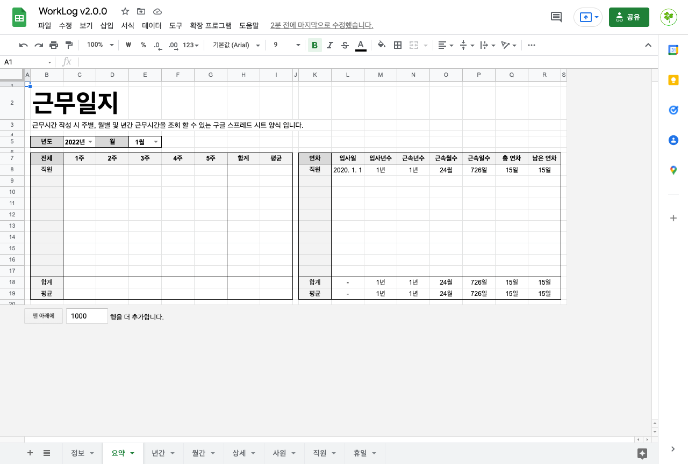
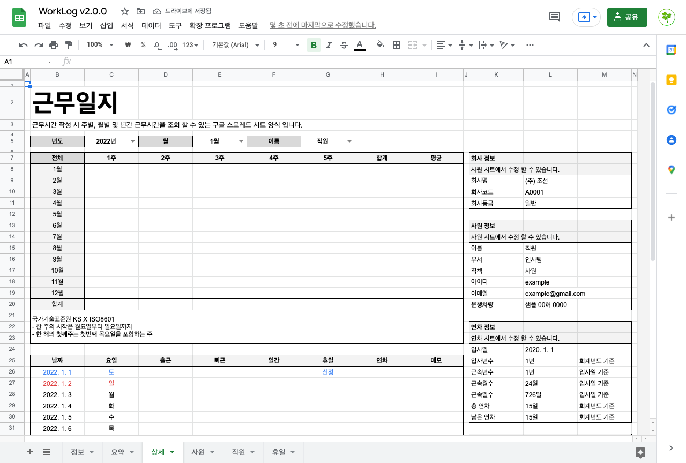
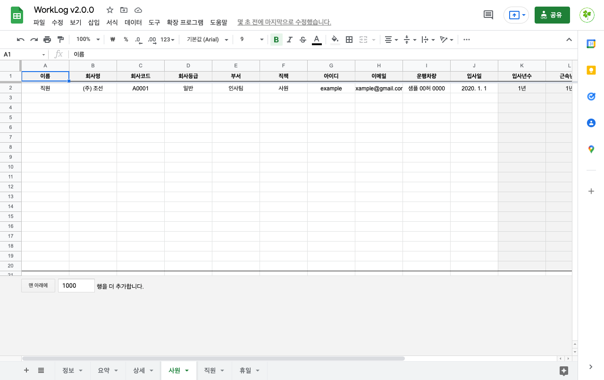
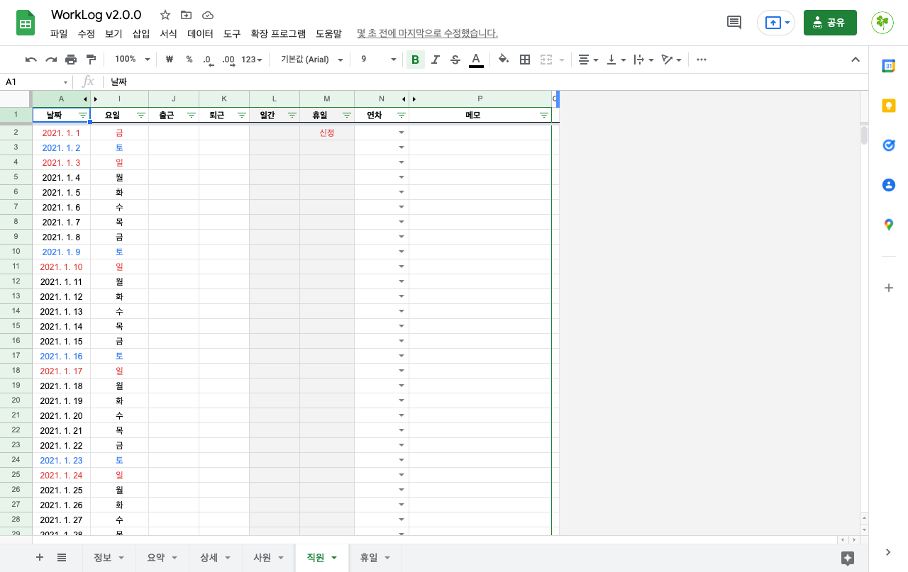
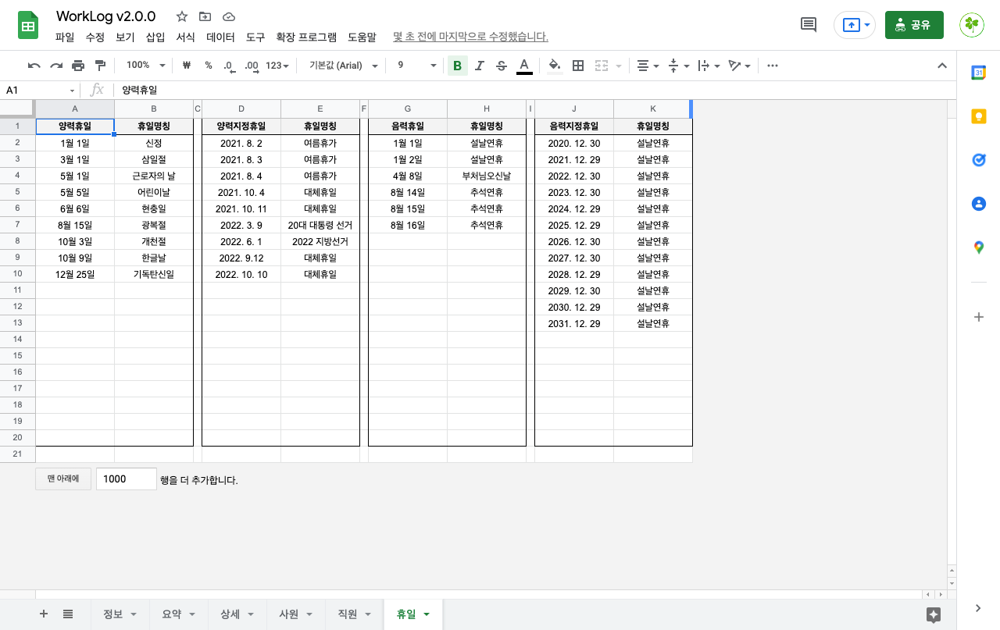

# 근무일지 - 구글 스프레드 시트

근무시간 작성 시 주별, 월별 및 년간 근무시간 및 연차정보를 조회 할 수 있는 구글 스프레드 시트 양식 입니다.

## 다운로드

[데모 스프레드 시트](https://docs.google.com/spreadsheets/d/1cqS0b_opkmaDRHdqJgc_gKpwfroTzu881Un1Tjl9mJI/edit?usp=sharing)로 이동 후 사본을 생성하여 사용 하세요.

- 활성 시트: 정보, 요약, 상세, 사원, 직원
- 숨김 시트: 년간, 월간, 연차, 휴일, 휴게, 휴가, 목록, 샘플, 달력

## 새로운 사원 등록 하는 방법

- 직원 시트를 복사하여 새로운 사원 이름으로 변경해 주세요.
- 사원 시트에 새로운 사원에 대한 정보를 입력해 주세요.

## 휴일 추가 하는 방법

부여 하고 싶은 휴일을 휴일 시트에 추가 해 주세요.

- 양력휴일 및 음력휴일은 매년 공통적으로 적용되는 휴일 입니다.
- 양력지정휴일 및 음력지정휴일은 사용자에 따라 변경되는 휴일 입니다.

## 휴게시간 추가 하는 방법

부여 하고 싶은 휴게시간을 휴게 시트에 추가 해 주세요.

- 휴게명칭: 매일 반복적으로 근무시간에서 제외 해야 하는 시간을 입력 합니다.
- 휴게날짜: 특정일에 일시적으로 근무시간에서 제외 해야 되는 시간을 입력 합니다.

## 주요 시트 정보

요약: 특정년도를 선택하여 모든 직원들에 대한 근무시간 및 연차 정보를 확인할 수 있습니다.

상세: 특정직원에 대한 상세 정보를 확인할 수 있습니다.

사원: 직원들에 대한 정보를 입력해 주세요.

직원: 새로운 사원이 추가될때 사용 됩니다.

휴일: 휴일을 표시하기 위해 사용 됩니다.

## 기타 시트 정보

- 년간: 특정년도를 기준으로 이후 12년간 모든 직원 들의 근무시간 정보를 확인할 수 있습니다.
- 월간: 특정년도에 해당하는 모든 직원들에 대한 근무시간 정보를 월간 정보로 확인할 수 있습니다.
- 달력: 음력 휴일을 계산 하기 위해 사용 됩니다.
- 샘플: 동적으로 날짜를 계산 하기 위해 사용 됩니다.
- 연차: 연차 일수를 계산할때 사용 됩니다.
- 휴가: 휴가 일수를 부여할때 참고할 수 있는 내용 입니다.
- 휴게: 근무시간 계산에 사용 됩니다.
- 목록: 모든 시트에 공통적으로 사용 됩니다.

## 라이센스

이 소프트웨어는 [MIT LICENSE](LICENSE)에 따라 사용이 허가되었습니다.
